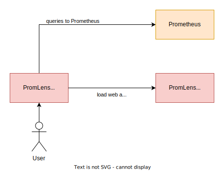
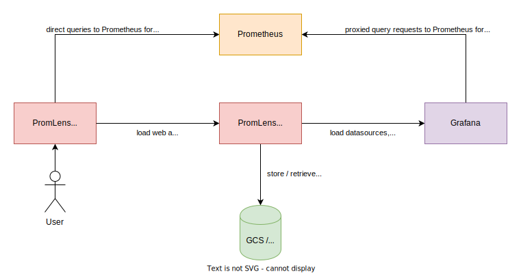

# PromLens

PromLens is a web-based PromQL query builder, analyzer, and visualizer.

PromLens was initially created as a commercial software by [PromLabs](https://promlabs.com/) and then donated to the open-source Prometheus project by PromLabs and [Chronosphere](https://www.chronosphere.io/).

## Reporting issues

Please file issues on the [GitHub issue tracker](https://github.com/prometheus/promlens/issues).

## Installing PromLens

There are multiple ways of installing PromLens:

### Using pre-built release binaries

You can find pre-built release binaries for PromLens on the [GitHub releases page](https://github.com/prometheus/promlens/releases).

### Using Docker

Docker images are available on [Docker Hub](https://hub.docker.com/r/prom/promlens) and [Quay](https://quay.io/repository/prometheus/promlens).

As a minimal example, you should be able to run PromLens like this:

```
docker run -p 8080:8080 prom/promlens
```

### Building from source

To build PromLens from source, you need:

* Go [version 1.17 or greater](https://golang.org/doc/install).
* NodeJS [version 16 or greater](https://nodejs.org/).
  * Note: With NodeJS v17+ you may experience an `error:0308010C:digital envelope routines::unsupported` error. This can be worked around by either exporting the following environment variable `NODE_OPTIONS=--openssl-legacy-provider` (please be aware of security considerations) or downgrading to NodeJS v16 ([source](https://stackoverflow.com/a/69699772)).
* npm [version 7 or greater](https://www.npmjs.com/).

_Note: This is a non-exhaustive list of dependancies, as it is assumed some standard Unix tools are available on your system. Please review build error messages for more information on missing tools._

Start by cloning the repository:

```bash
git clone https://github.com/prometheus/promlens.git
cd promlens
```

Build PromLens:

```bash
make build
```

This builds the React-based web UI and compiles it into a Go binary that serves it.

Now you can run PromLens like this:

```bash
./promlens
```

## Running PromLens

The following documents how to run PromLens with various options and features.

### Example deployment

Let's start with a minimal and a more elaborate example first.

To run PromLens without any advanced features (link sharing, Grafana integration, etc.) enabled:

```
./promlens
```

This starts PromLens on http://localhost:8080/ (you can override this using the `--web.listen-address` flag).

To run PromLens with link sharing and Grafana integration enabled, using SQLite for link sharing (note that you will need to provide the `$GRAFANA_URL` and `$GRAFANA_API_KEY` environment variables for this to work):

```
./promlens \
  --shared-links.sql.driver=sqlite \
  --shared-links.sql.dsn=/tmp/promlens-links.db \
  --grafana.url=$GRAFANA_URL \
  --grafana.api-token=$GRAFANA_API_TOKEN
```

### Command-line flags

To see all available command-line flags, run:

```
./promlens --help
```

For boolean flags that default to `true`, you can set them to `false` by specifying `--no-<flag-name>`, e.g. `--no-shared-links.sql.create-tables`.

### Enabling link sharing

Link sharing allows persisting the state of an entire PromLens query page and sharing it with others.

By default, the link sharing backend is disabled. You can enable link sharing either via Google Cloud Storage, MySQL, or SQLite:

#### Google Cloud Storage

To use Google Cloud Storage (GCS) for link sharing, set the `--shared-links.gcs.bucket=<bucket name>` flag and set the `GOOGLE_APPLICATION_CREDENTIALS` environment variable to point to a JSON file containing your service account credentials (needs to have permission to create, delete, and view objects in the provided bucket).

#### SQLite

To save shared links to a local SQLite database, set the `--shared-links.sql.driver=sqlite` and `--shared-links.sql.dsn=<database filename>` flags.

#### MySQL

To save shared links in a MySQL database, set the `--shared-links.sql.driver=mysql` and `--shared-links.sql.dsn=<data source name>` flag (see https://github.com/go-sql-driver/mysql#dsn-data-source-name for MySQL DSN specifications).

By default, PromLens will try to auto-create the necessary tables in your MySQL database. This requires the PromLens database user to have `CREATE` permissions. To turn off automatic table creation for MySQL, set the `--no-shared-links.sql.create-tables` flag. If you want to create tables manually, run the following against your PromLens MySQL database:

```sql
CREATE TABLE IF NOT EXISTS link (
  id INT AUTO_INCREMENT PRIMARY KEY,
  created_at TIMESTAMP DEFAULT CURRENT_TIMESTAMP,
  short_name VARCHAR(11) UNIQUE,
  page_state TEXT
);

CREATE TABLE IF NOT EXISTS view(
  id INT AUTO_INCREMENT PRIMARY KEY,
  link_id INTEGER,
  viewed_at TIMESTAMP DEFAULT CURRENT_TIMESTAMP,
  FOREIGN KEY(link_id) REFERENCES link(id)
);
```

#### Postgres

To save shared links in a Postgres database, set the `--shared-links.sql.driver=postgres` and `--shared-links.sql.dsn=<data source name>` flag (see https://pkg.go.dev/github.com/lib/pq#hdr-Connection_String_Parameters for Postgres DSN specifications).

By default, PromLens will try to auto-create the necessary tables in your Postgres database. This requires the PromLens database user to have `CREATE` permissions. To turn off automatic table creation for Postgres, set the `--no-shared-links.sql.create-tables` flag. If you want to create tables manually, run the following against your PromLens Postgres database:

```sql
CREATE TABLE IF NOT EXISTS link (
  id SERIAL PRIMARY KEY,
  created_at timestamptz DEFAULT now(),
  short_name VARCHAR(11) UNIQUE,
  page_state TEXT
);

CREATE TABLE IF NOT EXISTS view(
  id SERIAL PRIMARY KEY,
  link_id INTEGER,
  viewed_at timestamptz DEFAULT now(),
  FOREIGN KEY(link_id) REFERENCES link(id)
);
```

### Enabling Grafana datasource integration

To enable selection of datasources from an existing Grafana installation, set the `--grafana.url` flag to the URL of your Grafana installation, as well as either the `--grafana.api-token` flag (providing an API token directly as a flag) or the `--grafana.api-token-file` flag (providing an API token from a file).

#### Creating a Grafana API token

To create an API token suitable for looking up datasources in Grafana:

- Head to "Configuration > API Keys" in Grafana.
- Click "Add API key".
- Give the key a descriptive name, set the "Role" to "Admin", and set its life time to the desired duration (long is recommended, as you will need to regenerate it frequently otherwise).
- Press "Add" and note down the displayed API key.

### Set Grafana datasource in URL

You can pre-select a specific Grafana datasource when the page loads by appending a `ds` query parameter to the PromLens URL. For example, https://promlens.com/?ds=1. This works along with the `q` query parameter and shared links. You can find the IDs of the datasources by visiting `<PromLenURL>/api/page_config`.

### Direct links to queries

You can link to a specific query without creating a persisted shared link by appending a `q` query parameter to the PromLens URL. For example, https://promlens.com/?q=up directly displays and executes the query `up`. For more complex shared pages, we still recommend creating a full shared page link, as this allows more control over the tree view state, as well as the selected visualization methods.

## Architecture

Depending on whether you use advanced features, the PromLens backend has fewer or more responsibilities:

### Basic features

When running the PromLens without any link sharing or Grafana integration, the backend is only used to serve static assets and parse PromQL queries into a tree view:



### Advanced features

If you enable link sharing and/or Grafana datasource integration, the backend also stores and retrieves shared links and connects to Grafana to list datasources and proxy queries:


